# Jarkom Modul 3 F02 2022

### Anggota:

1. [Andymas Narendra Bagaskara](https://github.com/zaibir123) (05111940000192)
2. [Jayanti Totti Andhina](https://github.com/JayantiTA) (5025201037)
3. [Gaudhiwaa Hendrasto](https://github.com/gaudhiwaa) (5025201066)

### Proxy Server

1.  Client hanya dapat mengakses internet diluar (selain) hari & jam
    kerja (senin-jumat 08.00 - 17.00) dan hari libur (dapat mengakses
    24 jam penuh)

Install squid pada node Berlint, kemudian backup file
/etc/squid/squid.conf ke file /etc/squid/squid.conf.bak

Tambahkan acl.conf:

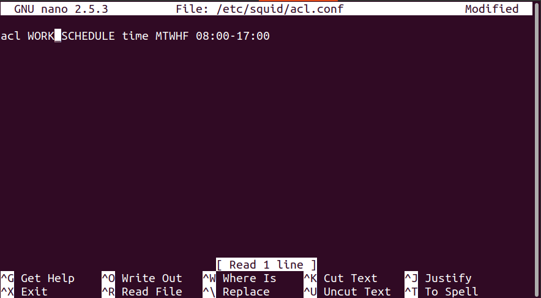

Tambahkan script pada /etc/squid/squid.conf:

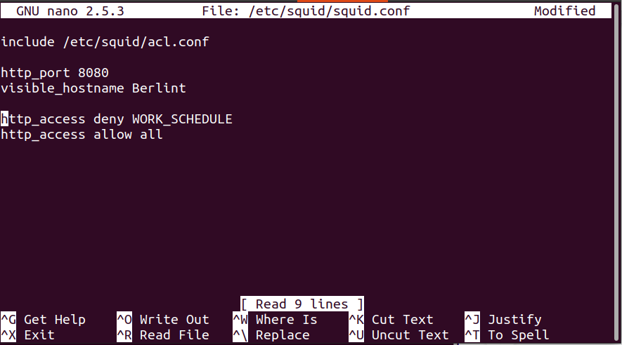

Pada client jalankan \`export
http\_proxy="[[http://192.200.2.3:8080]{.underline}](http://192.175.2.3:8080)"\`,
kemudian testing membuka google ketika jam kerja:

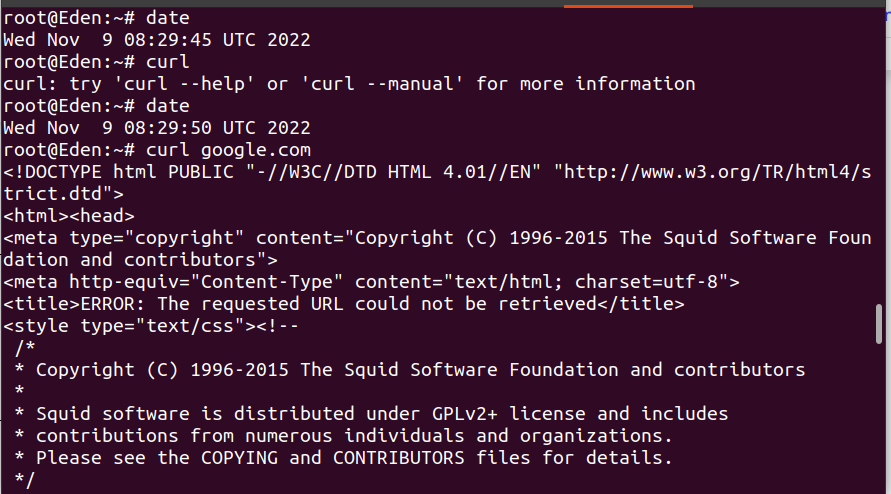

testing membuka google di luar jam kerja:

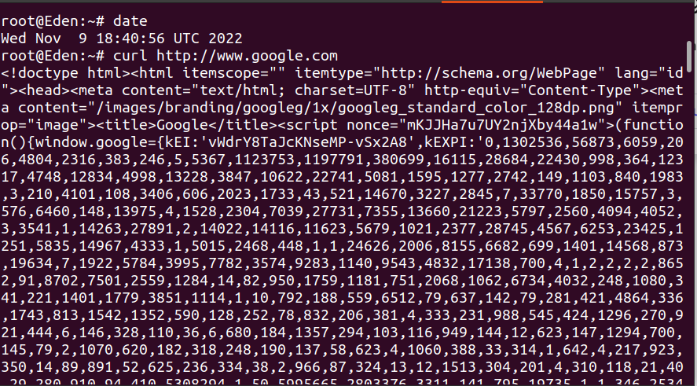

2.  Adapun pada hari dan jam kerja sesuai nomor (1), client hanya dapat
    mengakses domain loid-work.com dan franky-work.com (IP tujuan
    domain dibebaskan)

Tambahkan konfigurasi domain pada /etc/bind/named.conf.local pada
WISE:

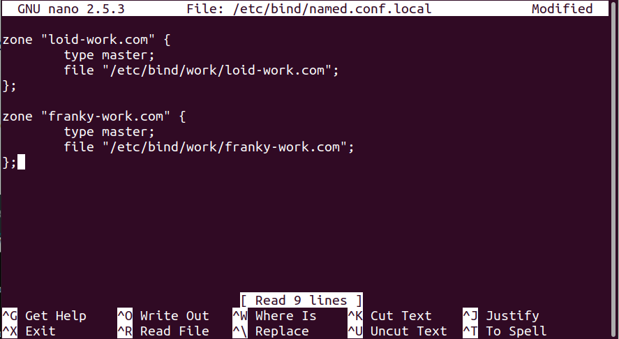

Buat direktori /etc/bind/work, kemudian copy isi db.local ke dalam
file loid-work.com dan franky-work.com:

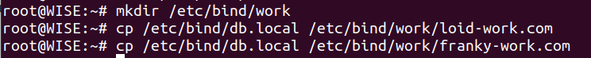

Kemudian edit isi /etc/bind/work/loid-work.com:

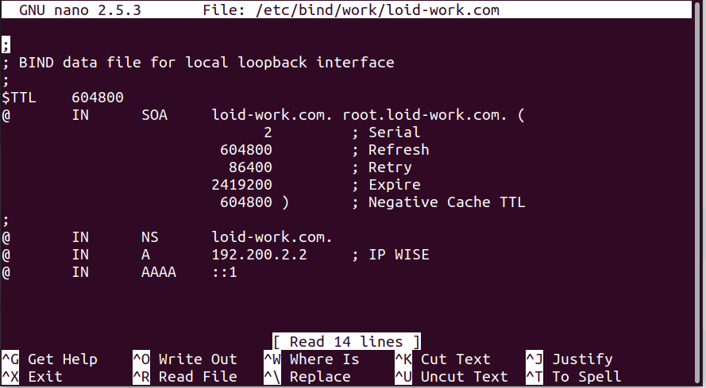

Edit juga isi /etc/bind/franky-work.com:

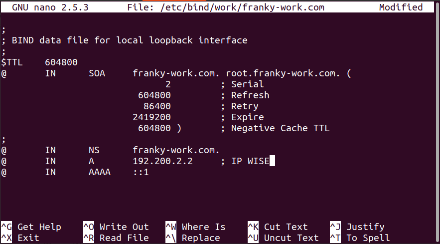

Kemudian restart service bind.

Tambahkan kedua domain tersebut pada /etc/squid/work-sites.acl:

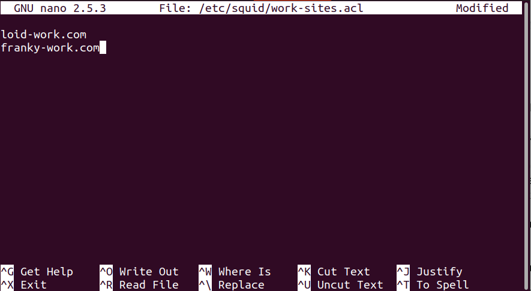

Kemudian tambahkan script pada /etc/squid/squid.conf:

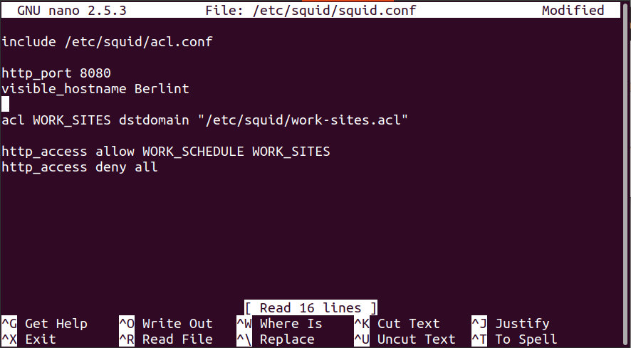

Testing pada client:

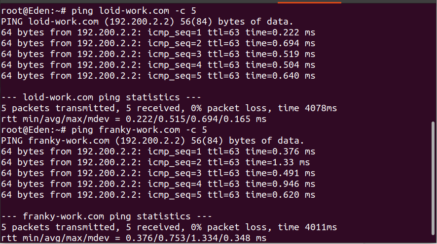

Jika diakses menggunakan lynx pada jam kerja maka akan muncul error
dengan kode 503:

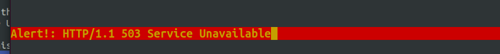

Jika diakses menggunakan lynx di luar jam kerja maka akan muncul error
403:

3.  Saat akses internet dibuka, client dilarang untuk mengakses web
    tanpa HTTPS. (Contoh web HTTP:
    [[http://example.com]{.underline}](http://example.com))

Tambahkan script pada squid.conf

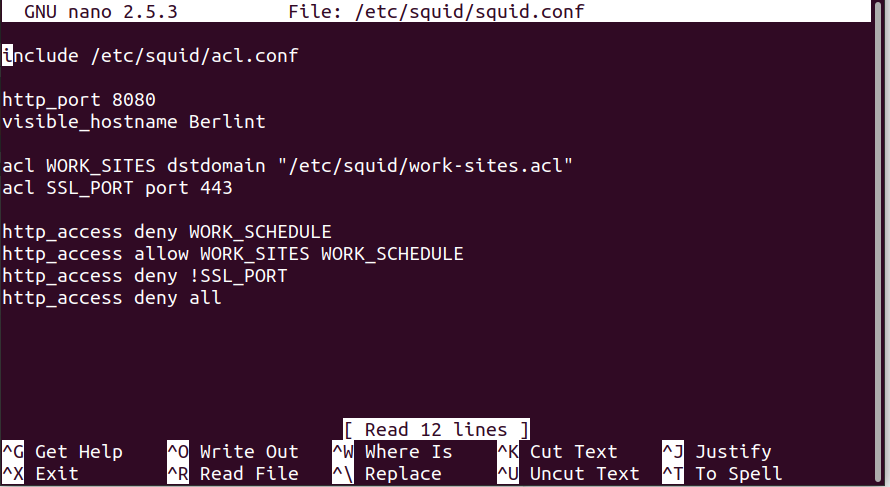

Testing pada client tanpa https:

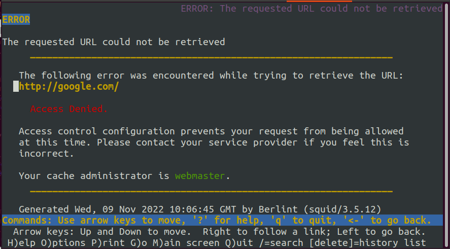

Testing pada client menggunakan https di luar jam kerja:

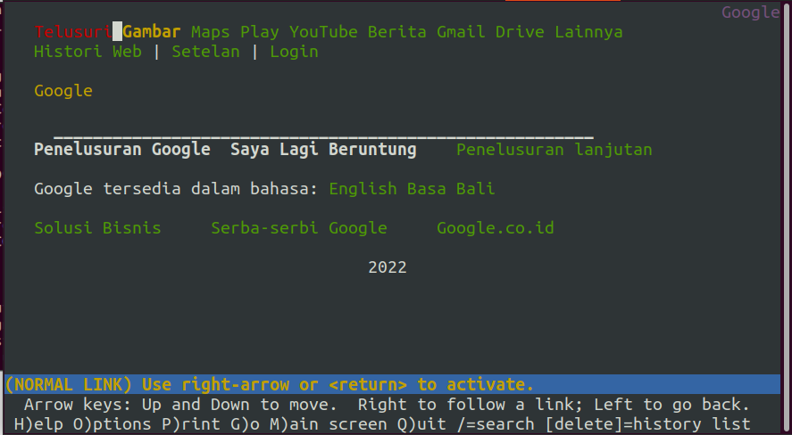

4.  Agar menghemat penggunaan, akses internet dibatasi dengan kecepatan
    maksimum 128 Kbps pada setiap host (Kbps = kilobit per second;
    lakukan pengecekan pada tiap host, ketika 2 host akses internet
    pada saat bersamaan, **keduanya mendapatkan speed maksimal yaitu
    128 Kbps**)

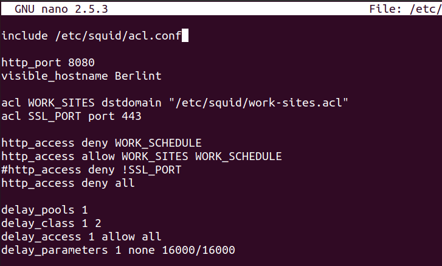

5.  Setelah diterapkan, ternyata peraturan nomor (4) mengganggu
    produktifitas saat hari kerja, dengan demikian pembatasan
    kecepatan hanya diberlakukan untuk pengaksesan internet pada hari
    libur

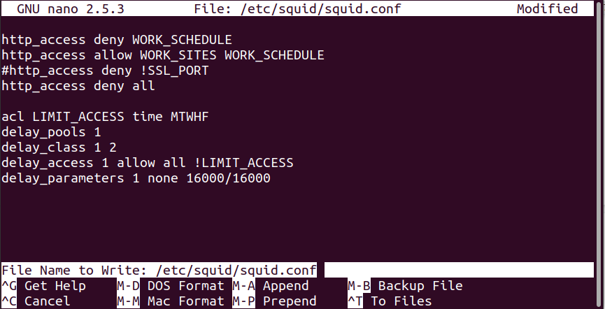

