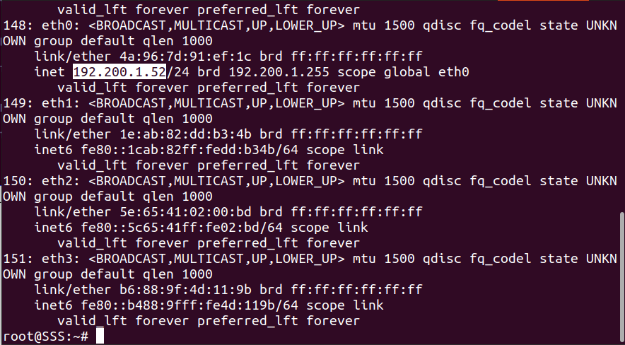

# Jarkom Modul 3 F02 2022

### Anggota:

1. [Andymas Narendra Bagaskara](https://github.com/zaibir123) (05111940000192)
2. [Jayanti Totti Andhina](https://github.com/JayantiTA) (5025201037)
3. [Gaudhiwaa Hendrasto](https://github.com/gaudhiwaa) (5025201066)

### Topologi:

### DHCP:

1.  WISE sebagai DNS Server:

Kemudian install bind9

Westalis sebagai DHCP Server:

Kemudian install isc-dhcp-server

Setup /etc/default/isc-dhcp-server:

Setup dhcpd.conf:

Berlint sebagai Proxy Server:

Kemudian install squid

Clients network interfaces (SSS, Garden, Eden, NewstonCastle,
KemonoPark):

2.  Setup network interfaces Ostania sebagai DHCP Relay:

Kemudian install isc-dhcp-relay

Setup /etc/default/isc-dhcp-relay:

3.  Client yang melalui Switch1 mendapatkan range IP dari \[prefix
    IP\].1.50 - \[prefix IP\].1.88 dan 192.200.1.120 - 192.200.1.155

Restart node client terlebih dahulu, kemudian testing client pada
switch1:

4.  Client yang melalui Switch3 mendapatkan range IP dari \[prefix
    IP\].3.10 - \[prefix IP\].3.30 dan 192.200.3.60 - 192.200.3.85

Restart node client terlebih dahulu, kemudian testing client pada
switch3:

5.  Client mendapatkan DNS dari WISE dan client dapat terhubung dengan
    internet melalui DNS tersebut.

Tambahkan DNS Forwarder pada WISE:

Client pada switch1:

Client pada switch3:

6.  Lama waktu DHCP server meminjamkan alamat IP kepada Client yang
    melalui Switch1 selama 5 menit sedangkan pada client yang melalui
    Switch3 selama 10 menit. Dengan waktu maksimal yang dialokasikan
    untuk peminjaman alamat IP selama 115 menit.

Ubah default-lease-time menjadi 300 dan max-lease-time menjadi 6900
pada switch1:

Ubah default-lease-time menjadi 600 dan max-lease-time menjadi 6900
pada switch3:

7.  Loid dan Franky berencana menjadikan **Eden** sebagai server untuk
    pertukaran informasi dengan **alamat IP yang tetap** dengan IP
    \[prefix IP\].3.13

Cek hwaddress milik Eden:

Tambahkan script pada /etc/dhcp/dhcpd.conf:

Tambahkan network interfaces pada Eden:

Restart isc-dhcp-server dan restart node Eden, kemudian cek ip Eden:

### Proxy Server

1.  Client hanya dapat mengakses internet diluar (selain) hari & jam
    kerja (senin-jumat 08.00 - 17.00) dan hari libur (dapat mengakses
    24 jam penuh)

Install squid pada node Berlint, kemudian backup file
/etc/squid/squid.conf ke file /etc/squid/squid.conf.bak

Tambahkan acl.conf:

Tambahkan script pada /etc/squid/squid.conf:

Pada client jalankan \`export
http\_proxy="[[http://192.200.2.3:8080]{.underline}](http://192.175.2.3:8080)"\`,
kemudian testing membuka google ketika jam kerja:

testing membuka google di luar jam kerja:

2.  Adapun pada hari dan jam kerja sesuai nomor (1), client hanya dapat
    mengakses domain loid-work.com dan franky-work.com (IP tujuan
    domain dibebaskan)

Tambahkan konfigurasi domain pada /etc/bind/named.conf.local pada
WISE:

Buat direktori /etc/bind/work, kemudian copy isi db.local ke dalam
file loid-work.com dan franky-work.com:

Kemudian edit isi /etc/bind/work/loid-work.com:

Edit juga isi /etc/bind/franky-work.com:

Kemudian restart service bind.

Tambahkan kedua domain tersebut pada /etc/squid/work-sites.acl:

Kemudian tambahkan script pada /etc/squid/squid.conf:

Testing pada client:

Jika diakses menggunakan lynx pada jam kerja maka akan muncul error
dengan kode 503:

Jika diakses menggunakan lynx di luar jam kerja maka akan muncul error
403:

3.  Saat akses internet dibuka, client dilarang untuk mengakses web
    tanpa HTTPS. (Contoh web HTTP:
    [[http://example.com]{.underline}](http://example.com))

Tambahkan script pada squid.conf

Testing pada client tanpa https:

Testing pada client menggunakan https di luar jam kerja:

4.  Agar menghemat penggunaan, akses internet dibatasi dengan kecepatan
    maksimum 128 Kbps pada setiap host (Kbps = kilobit per second;
    lakukan pengecekan pada tiap host, ketika 2 host akses internet
    pada saat bersamaan, **keduanya mendapatkan speed maksimal yaitu
    128 Kbps**)

5.  Setelah diterapkan, ternyata peraturan nomor (4) mengganggu
    produktifitas saat hari kerja, dengan demikian pembatasan
    kecepatan hanya diberlakukan untuk pengaksesan internet pada hari
    libur

